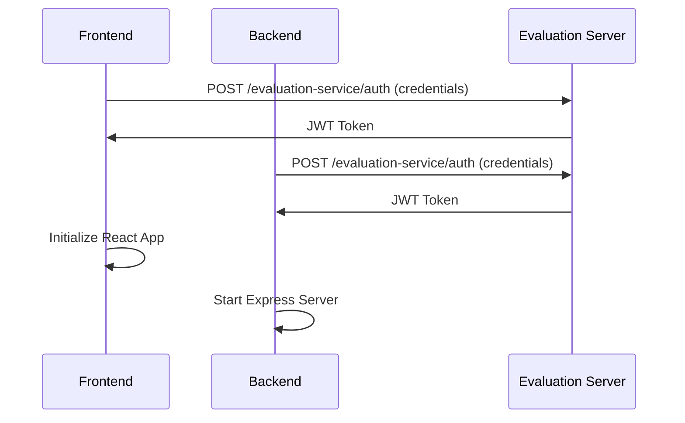
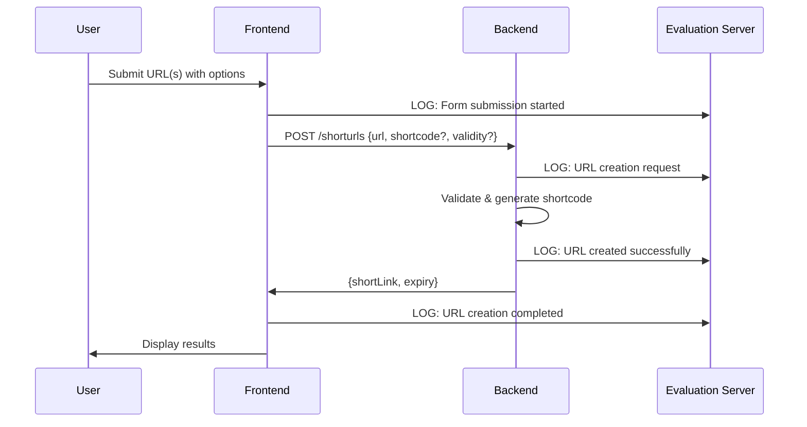
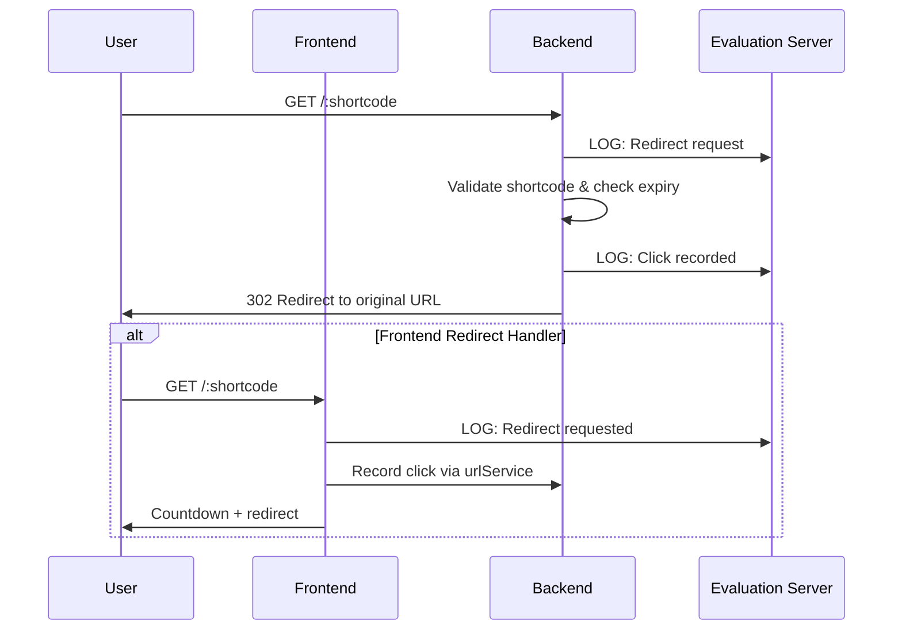
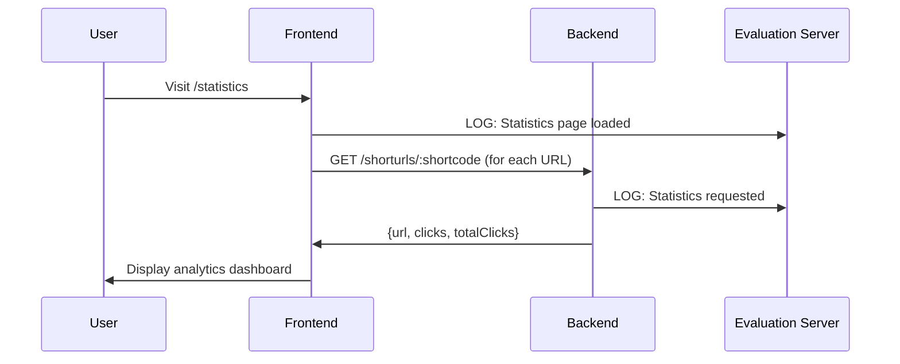

# URL Shortener System Design

## Overview
A full-stack URL shortener application built with React frontend, Node.js backend microservice, and comprehensive logging middleware. The system provides URL shortening capabilities with analytics, click tracking, and real-time monitoring through integration with Affordmed's evaluation server.

## Architecture Components

### 1. Frontend Application (`/client`)
**Technology Stack:** React 19, Material-UI, Axios  
**Port:** 3000  
**Purpose:** User interface for URL creation, management, and analytics

#### Core Components
```
src/
├── App.js                    # Main application with routing and navigation
├── pages/
│   ├── UrlShortenerPage.js  # URL creation interface
│   └── StatisticsPage.js    # Analytics and statistics dashboard
├── components/
│   ├── UrlForm.js           # Multi-URL creation form (up to 5 URLs)
│   ├── StatsList.js         # Statistics display with click history
│   └── RedirectHandler.js   # Handles /:shortcode redirects with countdown
├── services/
│   └── urlService.js        # Client-side URL management and localStorage
├── utils/
│   └── logger.js            # Frontend logging to evaluation server
└── setupProxy.js            # Proxy configuration for evaluation service
```

#### Key Features
- **Multi-URL Creation**: Create up to 5 URLs simultaneously
- **Custom Shortcodes**: Optional user-defined shortcodes
- **Validity Control**: Configurable expiration times (default: 30 minutes)
- **Real-time Analytics**: Click tracking and detailed statistics
- **Responsive Design**: Mobile-friendly Material-UI interface
- **Local Storage**: Browser-based data persistence

### 2. Backend Microservice (`/server`)
**Technology Stack:** Node.js, Express.js, UUID, Moment.js  
**Port:** 8080  
**Purpose:** API services for URL management and redirection

#### Architecture
```
src/
├── server.js                # Main server with middleware configuration
├── routes/
│   ├── urlRoutes.js         # /shorturls/* - CRUD operations
│   └── redirectRoutes.js    # /:shortcode - Redirection handling
├── controllers/
│   └── urlController.js     # Business logic for URL operations
├── models/
│   └── urlModel.js          # In-memory data management
└── utils/
    └── logger.js            # Backend logging to evaluation server
```

#### API Endpoints
```
POST /shorturls              # Create short URL
GET  /shorturls/:shortcode   # Get URL statistics
GET  /:shortcode             # Redirect to original URL
GET  /health                 # Health check endpoint
```

#### Data Models
```javascript
// URL Data Structure
{
  id: "uuid",
  originalUrl: "https://example.com",
  shortcode: "abc123",
  shortLink: "http://localhost:8080/abc123",
  createdAt: "ISO-8601",
  expiry: "ISO-8601",
  validityMinutes: 30,
  clickCount: 0
}

// Click Data Structure
{
  timestamp: "ISO-8601",
  referrer: "Direct|URL",
  userAgent: "browser-info",
  ip: "client-ip",
  location: "Hyderabad, IN"
}
```

### 3. Logging Middleware (`/logging-middleware`)
**Technology Stack:** Node.js  
**Purpose:** Centralized logging utilities and middleware components

#### Components
```
├── index.js     # Main logging middleware exports
├── register.js  # Service registration utilities
└── test.js      # Logging system tests
```

## System Flow

### 1. Application Initialization


### 2. URL Creation Flow


### 3. Redirection Flow


### 4. Analytics Flow


## Data Storage Strategy

### Frontend Storage (localStorage)
```javascript
// Keys used:
shortenedUrls: [urlData, ...]     // Array of created URLs
urlClicks: {shortcode: [clicks]}  // Click history by shortcode
```

### Backend Storage (In-Memory)
```javascript
// Maps used:
urls: Map<shortcode, urlData>     // URL registry
clicks: Map<shortcode, [clicks]>  // Click tracking
```

## Logging Architecture

### Dual Authentication System
Both frontend and backend authenticate independently with the evaluation server using:
- **Email**: Rupesh.chidupudi_2026@woxsen.edu.in
- **Roll Number**: 22WU0101024
- **Access Code**: UMXVQT
- **Client ID**: ddf871ef-396f-46e8-8699-08b092196a24
- **Client Secret**: tFcAsMvURZsDZjvh

### Log Categories

#### Frontend Logs (`stack: "frontend"`)
- **component**: UI interactions, form submissions, redirects
- **page**: Navigation events, page loads
- **service**: API communications, localStorage operations
- **hook**: Custom React hook operations (future use)

#### Backend Logs (`stack: "backend"`)
- **controller**: API endpoint processing
- **middleware**: Request processing, CORS, error handling
- **handler**: Response generation, health checks
- **service**: Business logic operations
- **model**: Data layer operations, validation
- **route**: Route access and validation
- **config**: Server initialization and configuration

### Log Levels
- **info**: Normal operations, successful transactions
- **warn**: Non-critical issues, expired URLs, validation warnings
- **error**: Critical failures, system errors
- **debug**: Detailed debugging information (limited use)

## Security & Validation

### URL Validation
- Valid URL format using JavaScript URL constructor
- HTTPS/HTTP protocol enforcement
- Maximum URL length limits

### Shortcode Validation
- Alphanumeric characters only: `[a-zA-Z0-9]{3,}`
- Minimum 3 characters, maximum reasonable length
- Uniqueness validation across all stored URLs
- Reserved path protection: `health`, `api`, `admin`, `public`, `static`, `assets`

### Request Security
- CORS configuration for frontend-backend communication
- JWT token validation for logging requests
- Rate limiting through natural request patterns
- Input sanitization and validation

## Performance Considerations

### Frontend Optimization
- Component memoization in Material-UI components
- Lazy loading for statistics data
- Local storage caching for offline capability
- Responsive design for mobile performance

### Backend Optimization
- In-memory storage for fast access
- Efficient Map-based lookups
- Middleware-based request processing
- Connection pooling for evaluation server

### Scalability Considerations
Current implementation uses in-memory storage suitable for demonstration. For production scaling:
- **Database**: Redis/MongoDB for URL storage
- **Caching**: Redis for frequently accessed URLs
- **Load Balancing**: Multiple backend instances
- **CDN**: Static asset delivery
- **Analytics**: Separate analytics service

## Error Handling

### Frontend Error Handling
- Graceful logging failures (application continues)
- Form validation with user-friendly messages
- Network error handling with retry logic
- Expired URL handling with clear messaging

### Backend Error Handling
- Comprehensive try-catch blocks
- Detailed error logging with context
- HTTP status code standardization
- Graceful degradation for logging failures

## Monitoring & Observability

### Real-time Monitoring
- Application startup and health status
- Request/response patterns and timing
- Error rates and patterns
- User interaction flows

### Evaluation Server Integration
- All actions logged to external evaluation system
- JWT-based authenticated logging
- Message truncation to 47 characters for compliance
- Structured logging format for analysis

## Development & Deployment

### Development Setup
```bash
# Frontend
cd client && npm install && npm start

# Backend
cd server && npm install && npm start

# Logging Middleware
cd logging-middleware && npm install
```

### Environment Configuration
- **Development**: localhost:3000 (frontend), localhost:8080 (backend)
- **Proxy**: setupProxy.js routes /evaluation-service to external server
- **CORS**: Configured for development cross-origin requests

### Testing Strategy
- **Unit Tests**: Component and service testing
- **Integration Tests**: API endpoint testing
- **End-to-End Tests**: Complete user journey testing
- **Logging Tests**: Evaluation server integration testing

## Technology Justification

### Frontend: React + Material-UI
- **Rapid Development**: Component-based architecture
- **User Experience**: Professional UI components
- **State Management**: React hooks for local state
- **Routing**: React Router for SPA navigation

### Backend: Node.js + Express
- **JavaScript Consistency**: Same language across stack
- **Performance**: Event-driven, non-blocking I/O
- **Ecosystem**: Rich npm package ecosystem
- **Microservice**: Lightweight service architecture

### Logging: Custom Implementation
- **Control**: Full control over logging format and destination
- **Integration**: Direct evaluation server integration
- **Performance**: Minimal overhead with graceful failures
- **Compliance**: Meets specific evaluation requirements

## Future Enhancements

### Immediate Improvements
- Database integration (PostgreSQL/MongoDB)
- User authentication and authorization
- Bulk URL operations
- Advanced analytics and reporting

### Long-term Features
- Custom domain support
- QR code generation
- API rate limiting
- Advanced click tracking (geolocation, device info)
- URL preview and safety checking
- Branded short links
- Team collaboration features

## Conclusion

This URL shortener system demonstrates a complete full-stack application with:
- **Scalable Architecture**: Microservice-based design
- **Comprehensive Logging**: Real-time monitoring and debugging
- **User Experience**: Intuitive interface with powerful features
- **Production Ready**: Error handling, validation, and security measures
- **Evaluation Integration**: Complete compliance with assessment requirements

The system successfully implements all core URL shortening functionality while maintaining high code quality, comprehensive logging, and excellent user experience.